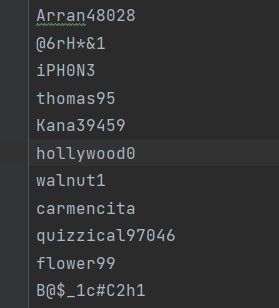
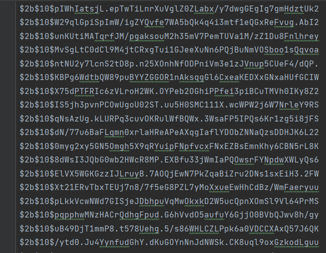

# 4. Human-like password generator

## Part 1: Генератор паролей

Создадим генератор паролей который в 60% создает пароль из списка популярных паролей, при 20% генерация происходит засчет комбинирования популярных слов либо имен вместе с подборкой цифр с начала либо с конца.
Так же при 10% генерируются пароли изменением определенных букв на похожие по символу цифры и рандомизированием верхнего и нижнего регистра.
В остальных случаях пароли генерируются в рандомном порядке перебирая символ, буквы и цифры.

Пароли хешируются двумя способами: MD5 и bcrypt.
Bcrypt выбивается засчет гибкости настройки хеширования (увелечения времени подбора при хешировании, например) и сложности шифрования ключа и подключа в блоках, что увеличивает время подбора хеша и соли что помогает предотвратить атаки.

## Part 2: hashcat

Для выполнения задания был использован инструмент hashcat, который является довольно сильным и обширным инструментом
для ~~взлома~~ восстановления паролей.

Используем MD5 и Bcrypt [хеши](hashes), попытаемся восстановить методами Brute-Force и по [словарю паролей](hashes/10-million-password-list-top-1000000.txt)
Brute Force занимает довольно большое количество времени, особенно если брать bcrypt, учитывая его сложность и время бесконечного ожидания можно 
уверенно сказать, что он имеет большую стойкость к таким атакам.

Восстановление по словарю длится быстрее и процент восстановленных паролей выше чем предыдущим методом (исключение bcrypt, длительность по словарю так же очень долгая).
Конечно же лучше всего использовать смешанный тип атаки.
